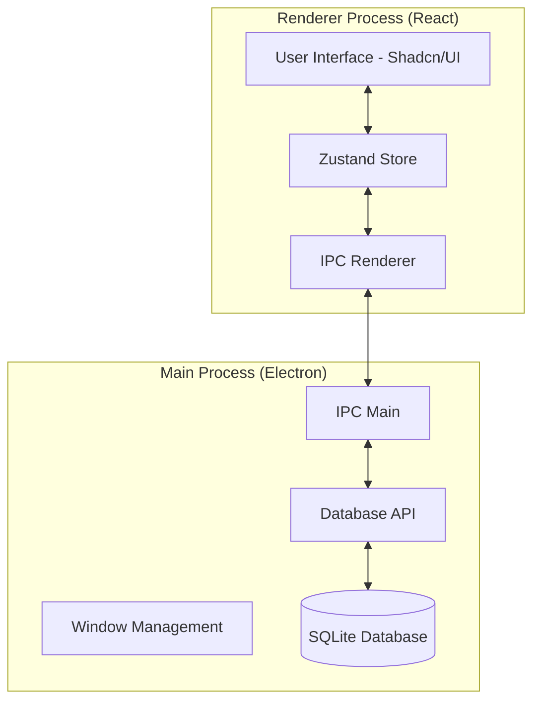

# TaskOverflow System Architecture

This document outlines the architecture for TaskOverflow as a desktop application built with Electron, React, and SQLite.

## Overview

TaskOverflow follows a multi-process architecture typical of Electron applications, separating the user interface from the system-level operations and data persistence.

### 1. High-Level Architecture

## 2. Process Responsibilities

### Main Process (Node.js)
- **Lifecycle Management**: Handles application startup, window creation, and graceful shutdown.
- **Native Integration**: Manages system tray, global shortcuts, and native menus.
- **Database Engine**: Executes SQL queries via `better-sqlite3`.
- **Security**: Implements a strict Content Security Policy (CSP) and exposes only necessary APIs via `contextBridge`.

### Renderer Process (React + Vite)
- **State Management**: Uses Zustand to manage in-memory application state and UI logic.
- **UI Components**: Built with React, Tailwind CSS, and Radix UI (Shadcn/UI).
- **Communication**: Communicates with the Main process using asynchronous IPC calls.

## 3. Data Persistence (SQLite)

Data is stored locally in a SQLite database file located in the user's application data directory.

### Schema Design

#### `groups` Table
- `id` (TEXT, PRIMARY KEY): UUID
- `name` (TEXT): Group name
- `emoji` (TEXT): Icon identifier
- `accent` (TEXT): Color theme (e.g., 'blue', 'teal')
- `position` (INTEGER): Sorting order
- `created_at` (INTEGER): Timestamp

#### `tasks` Table
- `id` (TEXT, PRIMARY KEY): UUID
- `group_id` (TEXT, FOREIGN KEY): References `groups.id`
- `title` (TEXT): Task summary
- `notes` (TEXT): Detailed description
- `status` (TEXT): 'todo' | 'done'
- `due_date` (TEXT): ISO 8601 string or NULL
- `position` (INTEGER): Sorting order within group
- `created_at` (INTEGER): Timestamp
- `completed_at` (INTEGER): Timestamp or NULL

#### `subtasks` Table
- `id` (TEXT, PRIMARY KEY): UUID
- `task_id` (TEXT, FOREIGN KEY): References `tasks.id`
- `title` (TEXT): Subtask text
- `is_done` (BOOLEAN): Completion status
- `position` (INTEGER): Sorting order

#### `tags` Table
- `id` (INTEGER, PRIMARY KEY AUTOINCREMENT)
- `name` (TEXT, UNIQUE): Tag name

#### `task_tags` (Join Table)
- `task_id` (TEXT, FOREIGN KEY): References `tasks.id`
- `tag_id` (INTEGER, FOREIGN KEY): References `tags.id`

#### `settings` Table
- `key` (TEXT, PRIMARY KEY): Setting identifier
- `value` (TEXT): JSON stringified value

## 4. State Synchronization Strategy

The application uses a "Hydrate and Sync" strategy:
1. **Hydration**: On startup, the Renderer process requests the initial state from the Main process.
2. **Optimistic Updates**: UI state updates immediately in Zustand.
3. **Background Sync**: Changes are sent via IPC to the Main process to be persisted in SQLite.
4. **Error Handling**: If a persistence operation fails, the UI notifies the user and potentially rolls back the state.

## 5. Security & Performance

- **IPC Security**: No raw SQL is sent over IPC. Instead, predefined API methods (e.g., `createTask`, `updateGroup`) are used.
- **Indexing**: Frequent queries (e.g., `tasks.group_id`, `tasks.status`) are optimized with SQLite indexes.
- **Write-Ahead Logging (WAL)**: Enabled for SQLite to improve concurrency and performance during high-frequency updates.
