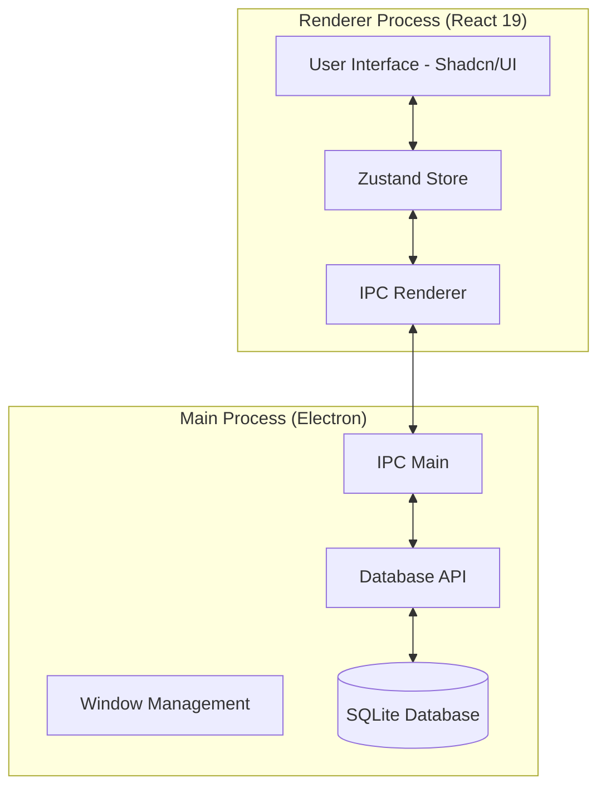

# TaskOverflow

TaskOverflow is a minimalist, industry-grade task management desktop application built with **Electron**, **React (v19)**, and **SQLite**. It offers a clean, efficient interface for organizing your work into groups, managing subtasks, and keeping track of deadlines with local-first data persistence.


## 🚀 Version 1.0.0

The first version of TaskOverflow focuses on core productivity features with a focus on speed, offline reliability, and a polished user experience.

- **Grouped Task Management**: Organize tasks into custom groups with distinct accents and emojis.
- **Detailed Task Control**: Add notes, due dates, and tags to your tasks.
- **Subtasks**: Break down complex tasks into manageable steps.
- **Theme-Aware UI**: Seamlessly switch between Light and Dark modes.
- **Dynamic Icons**: The application icon and favicon adapt to your system theme.
- **Local-First Persistence**: Your data never leaves your machine, stored securely in a local SQLite database.
- **Keyboard Friendly**: Built-in shortcuts for rapid task entry and navigation.

---

## 🏗️ System Architecture

TaskOverflow follows a robust multi-process architecture to ensure security, performance, and a responsive UI.

### Overview



### Core Components

- **Main Process (Node.js)**: Handles application lifecycle, window management, and native system integration. It hosts the SQLite engine and manages data persistence via `better-sqlite3`.
- **Renderer Process (React)**: Powers the user interface using React 19, Tailwind CSS, and Shadcn/UI. Application state is managed by **Zustand** for high-performance updates.
- **Inter-Process Communication (IPC)**: A secure bridge that allows the UI to communicate with the system-level database without exposing sensitive APIs.
- **SQLite Database**: A local-first storage solution ensuring your data is always accessible, even without an internet connection.

---

## 🛠️ Installation & Development

### Prerequisites

- [Node.js](https://nodejs.org/) (LTS version recommended)
- npm or pnpm

### Setup

1. **Clone the repository**:
   ```bash
   git clone https://github.com/your-username/TaskOverflow.git
   cd TaskOverflow
   ```

2. **Install dependencies**:
   ```bash
   npm install
   ```

### Running the App

- **Development Mode**: Starts the app with hot-reloading for rapid UI development.
  ```bash
   npm run dev
   ```

- **Build Application**: Packages the application for your specific operating system.
  - **Windows**: `npm run build:win`
  - **macOS**: `npm run build:mac`
  - **Linux**: `npm run build:linux`

### Data Storage

On Windows, your task data is stored in:
`%APPDATA%/TaskOverflow/taskoverflow.db`

---

## ⌨️ Keyboard Shortcuts

| Shortcut | Action |
| :--- | :--- |
| `Ctrl + N` | New Task |
| `Ctrl + G` | New Group |
| `Ctrl + F` | Focus Search |
| `Ctrl + B` | Toggle Sidebar |
| `Ctrl + ,` | Settings |

---

## 📄 License

Built with ❤️ for productivity. Licensed under the MIT License.
